# VibePortal

**English** | [简体中文](README.zh-CN.md)

<p align="center"></p>

<h3 align="center">A desktop pet that actually knows what your AI coding agents are doing.</h3>

<p align="center">
Claude Code and Codex in one place — live progress of every session, plan limits with run-out forecasts,<br>
new tasks from your phone, and a pixel crab that stir-fries while your commands run.<br>
<b>Ubuntu · Windows · Web · phone</b>
</p>

<p align="center">
<a href="https://github.com/CNStanLee/VibePortal/releases/latest"></a>


</p>

<p align="center">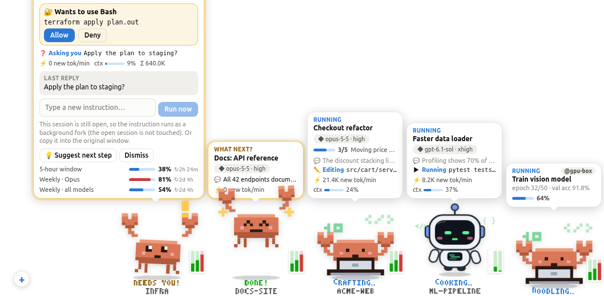</p>

<p align="center"><b>🌱 And a crab farm for your tokens</b> — the tokens your agents burn open seed cases, the plants grow while you code, and farmers visit and water each other's farms. <a href="#crab-farm">More ↓</a></p>
<p align="center">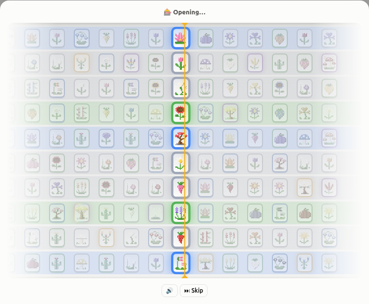 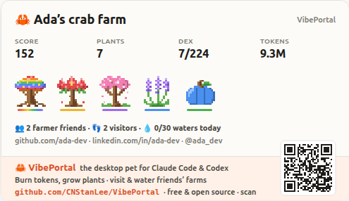</p>

## Why VibePortal

You run several agents at once. Somewhere a session is waiting for a permission, another one just finished, and the weekly limit is closer than you think. VibePortal turns all of that into something you can glance at.

| Tool | Desktop pet | Claude Code | Codex | Live progress (plan, tools) | Plan limits | Allow / Deny prompts | Start tasks & follow-ups | Phone / web |
| --- | :-: | :-: | :-: | :-: | :-: | :-: | :-: | :-: |
| **VibePortal** | ✅ | ✅ | ✅ | ✅ | ✅ | ✅ | ✅ | ✅ |
| [Codex Pets][codexpets] <sub>official</sub> | ✅ | ❌ | ✅ | ✅ | ❌ | ◐ | ◐ | ❌ |
| [Claude Code `/buddy`][buddy] <sub>official</sub> | ✅ | ✅ | ❌ | ❌ | ❌ | ❌ | ❌ | ❌ |
| [clawd-on-desk][clawd] | ✅ | ✅ | ✅ | ◐ | ✅ | ✅ | ❌ | ❌ |
| [Claude Status Pet][csp] | ✅ | ✅ | ❌ | ◐ | ❌ | ❌ | ❌ | ❌ |
| [Desktop Goose][goose] · [Shimeji-ee][shimeji] · [BongoCat][bongo] | ✅ | ❌ | ❌ | ❌ | ❌ | ❌ | ❌ | ❌ |
| [ccusage][ccusage] | ❌ | ✅ | ✅ | ❌ | ◐ | ❌ | ❌ | ❌ |
| [Claude Code Usage Monitor][ccmonitor] | ❌ | ✅ | ❌ | ❌ | ✅ | ❌ | ❌ | ❌ |
| [CodexBar][codexbar] | ❌ | ✅ | ✅ | ❌ | ✅ | ❌ | ❌ | ❌ |
| [Claude Squad][squad] | ❌ | ✅ | ✅ | ◐ | ❌ | ◐ | ✅ | ❌ |
| [opcode][opcode] | ❌ | ✅ | ❌ | ◐ | ◐ | ❌ | ✅ | ❌ |
| [Vibe Kanban][kanban] | ❌ | ✅ | ✅ | ◐ | ❌ | ◐ | ✅ | ◐ |

<sub>✅ yes · ◐ partly · ❌ no. From each project's own page or the cited coverage (October 2026); "partly" means for example state reactions instead of the plan and tool feed, token reports instead of live limits, approvals only inside that app, or a web UI meant for the same machine.</sub>

How VibePortal differs from the pets:

- **vs the official pets** — Codex Pets live in the Codex desktop app (Windows / macOS) and follow Codex only; Claude Code's `/buddy` is a companion character in the terminal rather than a status display. VibePortal follows Claude Code **and** Codex sessions, CLI and VS Code alike, gives each running task its own pet, shows both providers' plan limits, and works on Ubuntu, Windows, the web and your phone.
- **vs open-source agent pets** — [clawd-on-desk][clawd] and [Claude Status Pet][csp] react to agent state from hooks and logs. VibePortal adds the live plan and tool feed per task, a dashboard to start tasks and send follow-ups with model and effort, full conversations, remote machines and the agents' official Remote Control.


[codexpets]: https://engadget.com/2162796/openai-introduces-ai-generated-pets-for-its-codex-app
[buddy]: https://www.mindstudio.ai/blog/what-is-claude-code-buddy-feature
[clawd]: https://github.com/rullerzhou-afk/clawd-on-desk
[csp]: https://github.com/moeyui1/claude-status-pet
[goose]: https://samperson.itch.io/desktop-goose
[shimeji]: https://kilkakon.com/shimeji/
[bongo]: https://github.com/ayangweb/BongoCat
[ccusage]: https://github.com/ryoppippi/ccusage
[ccmonitor]: https://github.com/Maciek-roboblog/Claude-Code-Usage-Monitor
[codexbar]: https://github.com/steipete/CodexBar
[squad]: https://github.com/smtg-ai/claude-squad
[opcode]: https://github.com/winfunc/opcode
[kanban]: https://github.com/BloopAI/vibe-kanban

- 🦀 **A pet with a job.** The crab types on a laptop while code is edited, stir-fries while commands run, reads with glasses, sips tea while waiting — and pixel letters under it say *COOKING… / FORGING…* and which repo it's in. The bubble mirrors the agent's plan, its latest tool calls and its own words.
- ⚡ **Limits you can trust.** The same numbers as `/usage` and `/status`, every window with its own reset time, and a warning *before* you run out.
- 📱 **Your desk, in your pocket.** A password-protected link (with a permanent address through ngrok or Tailscale), a phone layout with a bottom tab bar, and one-click official Remote Control.
- 🌱 **A farm for your tokens.** The tokens your agents burn buy seed draws; grow 27 pixel species (up to a 0.1% mythic) on a 3×3 field, show them off on a shelf, visit and water your friends' farms, and share a card or a live GitHub README badge.
- 🔒 **Local first.** Everything is read from `~/.claude` and `~/.codex`; tokens never leave your machine except to the providers' own endpoints.

## Decentralized by design

There is **no VibePortal server, no VibePortal account and no telemetry** — so there is no central place where your data, chats or tokens could leak from.

- **Everything stays on your machines.** Each copy of VibePortal runs on your own computer and reads what Claude Code and Codex already store there (`~/.claude`, `~/.codex`). Machines talk to each other directly — on your LAN, or through a tunnel you choose.
- **Your logins never move.** Claude / ChatGPT tokens are read locally and sent only to Anthropic's and OpenAI's own endpoints, exactly like the CLIs do. They are never copied, uploaded or shown in the UI.
- **Sign-in is checked locally.** A password is stored only as a scrypt hash on that machine; Google sign-in is verified on each machine with Google's public keys (no client secret anywhere), and your device list lives in a hidden app folder in **your own** Google Drive.
- **What remains yours to decide:** with public access on, traffic passes through the relay you picked (ngrok, Tailscale, …), and anyone with your password or Google account could drive your agents — use a strong password and keep the Google account to yourself.

## Screenshots

<p align="center">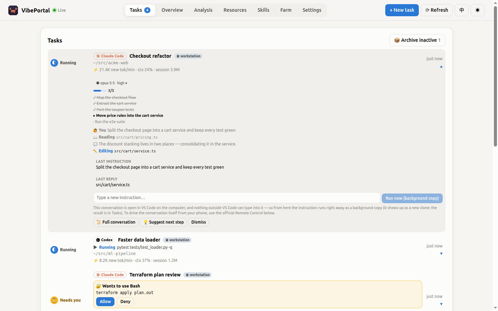</p>
<p align="center">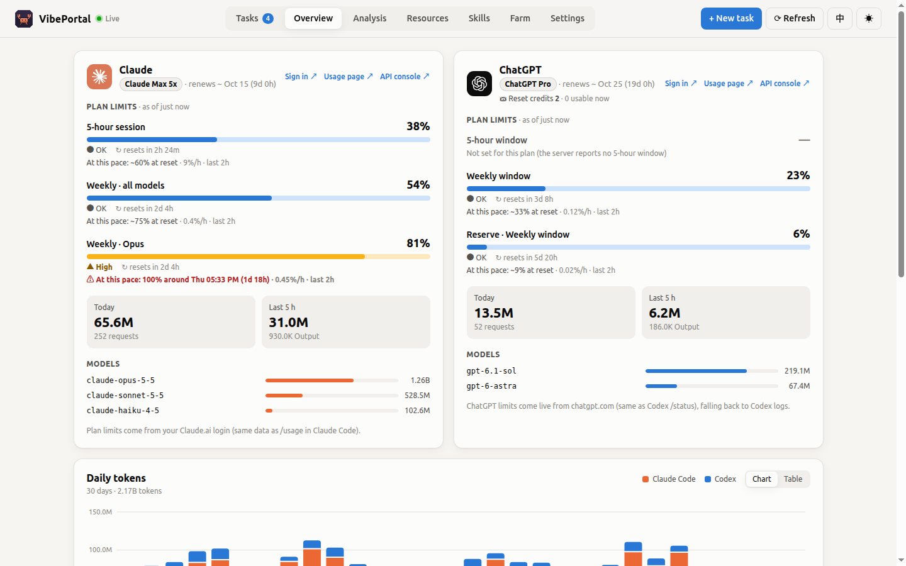</p>
<p align="center">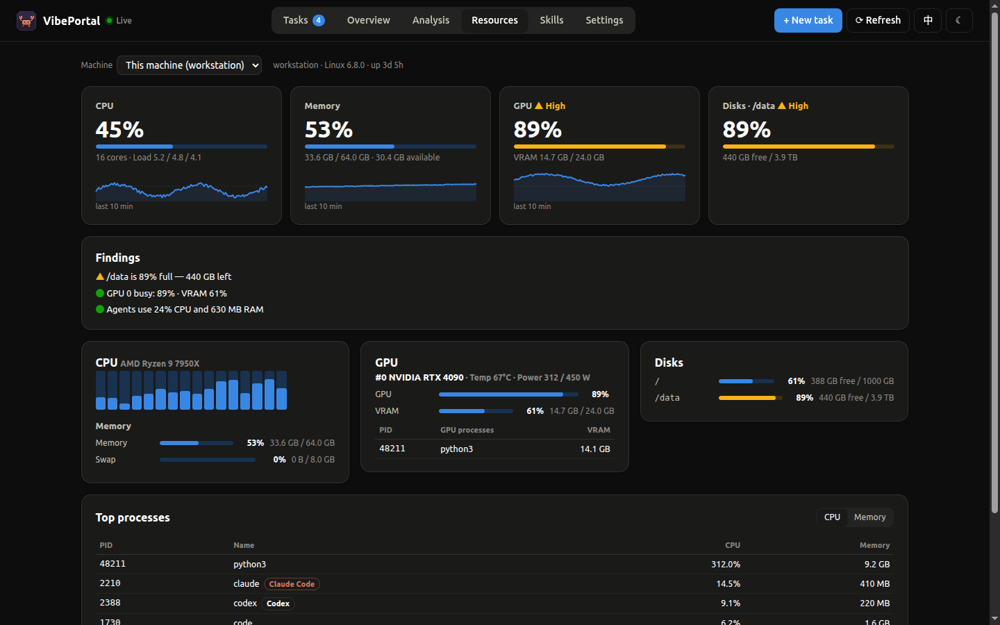</p>
<p align="center">
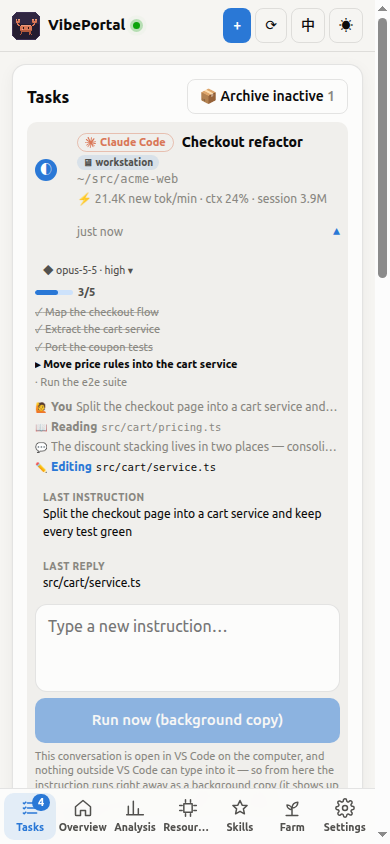
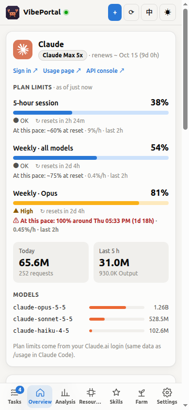
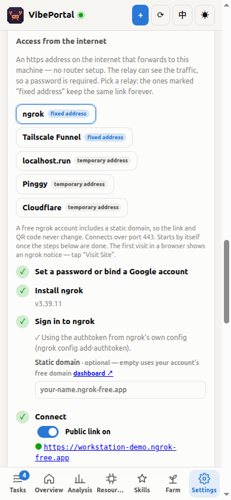
</p>
<p align="center">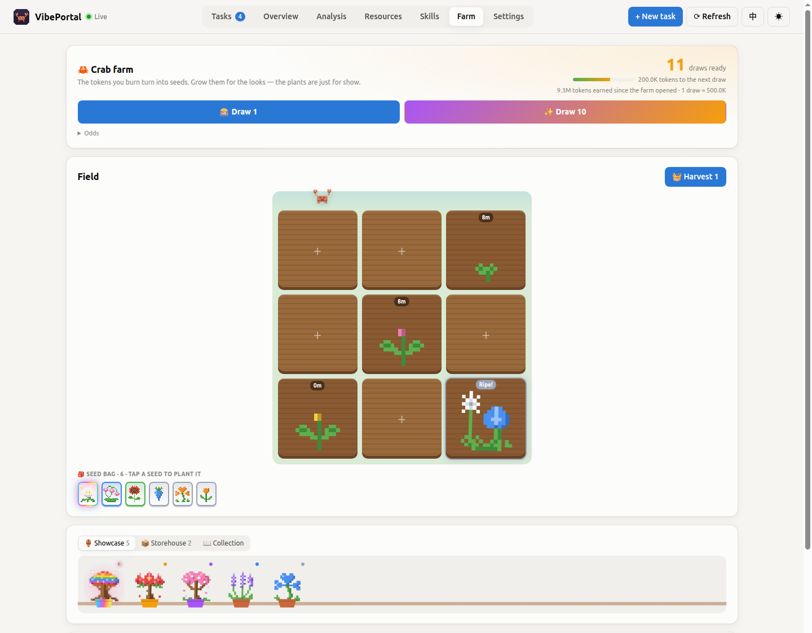</p>
<p align="center">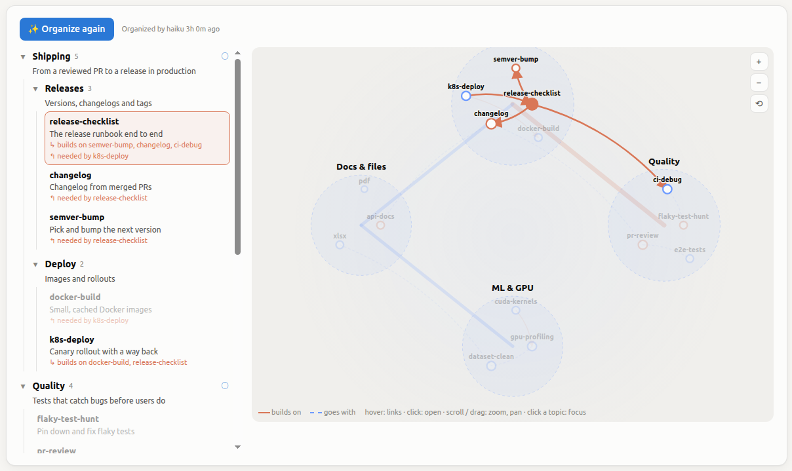</p>
<p align="center"></p>

<sub>Screenshots use the built-in demo data (`?demo`); regenerate them with `npm run screenshots`.</sub>

## Download

Installers are attached to every [release](https://github.com/CNStanLee/VibePortal/releases/latest):

| Platform | File |
| --- | --- |
| Ubuntu / Debian | `vibeportal_x.y.z_amd64.deb` (`sudo apt install ./vibeportal_*.deb`) or the portable `VibePortal-x.y.z.AppImage` (`chmod +x` and run) |
| Windows | `VibePortal Setup x.y.z.exe` (installer) or `VibePortal x.y.z.exe` (portable) |

The builds are unsigned: Windows SmartScreen may ask you to confirm ("More info → Run anyway").

## Features

| Area | What you get |
| --- | --- |
| **Plans** | Current Claude (Pro / Max 5x / Max 20x / Team…) and ChatGPT (Plus / Pro / Pro Lite / Team…) plans, the renewal date (projected monthly from the subscription start and marked "est." when the provider doesn't report one), and ChatGPT **rate-limit reset credits**. Each card links to **sign-in / usage page / API console** |
| **Limits** | Claude 5-hour session and weekly windows (all models / per model); ChatGPT primary / secondary windows and extra pools. **Every window shows its own reset time** (nothing is shared between windows or providers); the 5-hour window is always shown and marked when a plan has none |
| **Run-out forecast** | Records each window's usage curve and projects when it hits 100% from the last-2-hours pace / the window average, and whether that happens before the reset (notification + the pet raises the alarm) |
| **Analysis** | Claude / Codex tokens per repository (grouped by git root), share, API-equivalent cost, 14-day trend, last activity; input / output / cache breakdown per model; cache hit rate, burn rate, daily average; **subscription vs API**: what the last 30 days would have cost at API list prices against the plan's monthly fee — how much the plan saves, and how many times it pays for itself |
| **Tasks** | Finds Claude Code sessions and Codex tasks automatically (running / needs you / idle / done) with their workload (new-token rate, context use, session total); Claude Code hooks push events instantly; scripts can report custom tasks over HTTP. Rows expand to show progress, plan, model and actions. **Archive inactive** puts every idle / done / failed conversation away in one click (into a collapsed "Archived" list, shared by all your devices); one that gets a new message comes back by itself |
| **What next?** | When a task finishes or needs you, the pet asks "What next?": read the last reply, let Claude suggest next steps, send a new instruction (for a conversation open in VS Code the instruction goes to that very conversation, so there's one history), open the repo. A background run that is still busy **takes instructions too**: they queue and go on in the same conversation as soon as its turn ends. The card stays open on the run that carries your instruction, and runs (and their queue) **keep going when VibePortal restarts** |
| **Phone / web** | One click starts the agents' official Remote Control: Claude Code gets a claude.ai/code link + QR code for a folder; Codex starts its daemon in remote-control mode and shows a pairing code for the ChatGPT app |
| **Desktop pet** | A pixel crab for Claude Code and a round terminal robot for Codex (its screen is its face); either can be swapped for a milk frog, and Codex also has a whale girl skin. Under the pet, pixel letters hop to say what it's busy with (COOKING… / FORGING… / CRAFTING…) and in which repo; the bubble shows the current model and effort, switchable for the next instruction. **Clones** when several tasks run — one per task, each with its own state, workload and instructions — splitting off with an animation; the home pets show both providers' limits. The speech bubble **mirrors progress**: plan (TodoWrite / Codex update_plan), latest tool calls and the agent's own words, with bilingual labels, parsed from local logs and hooks — no extra model calls. The crab **acts it out**: typing on a laptop while editing code, stir-frying while commands run, reading with glasses, searching with a magnifier, sipping tea while waiting, eating rice when idle. Three **colored mini bars** (5-hour / weekly / tightest other window) give a feel for usage without opening anything. Drag to move, click to expand, double-click for the dashboard, right-click for the menu |
| **New task** | "+ New task" in the top bar or the + next to the pet: pick a repo or local VS Code project (VS Code's recent folders and open windows), Claude Code or Codex, model and effort, optional skills — it starts a background session and a new clone appears |
| **Skills** | Lists the VibePortal skill library, Claude Code / Codex user skills and the skill folders of your repos (name and description read straight from SKILL.md — no model calls). SKILL.md files that tasks write are archived to `~/.vibeportal/skills` automatically; add / edit by hand, install into Claude Code or Codex with one click, attach to a new task (the instruction lists the SKILL.md paths and the agent reads them). Shown as an interactive **knowledge map**: a tree of topics and a zoomable graph of clusters; **Organize** has the small model (the "suggest" one) sort the skills into topics with a one-line summary each (in the UI's language) and find which skills build on or go with which; hover a skill to light up its links, click to open it |
| **Resources** | CPU (per core), memory / swap, NVIDIA GPU (utilization, VRAM, temperature, power, GPU processes), disks and the busiest processes (Claude / Codex marked) of this machine or a remote one, with a 10-minute trend and plain-language findings; sampled only while the page is open |
| **Remote** | One switch for LAN / phone access (addresses + QR code); an **access password** (links and QR codes then carry no token — scan and sign in); **access from the internet** through a tunnel — a **fixed address** with ngrok (free account, static domain) or Tailscale Funnel, or a temporary one with localhost.run / Pinggy over the built-in ssh (no install, no account) or a Cloudflare quick tunnel — or your own public address, password required; merge other machines running VibePortal (e.g. GPU servers) — their tasks and limits show up here and actions are forwarded; LAN auto-discovery |
| **Crab farm** | The tokens you burn buy seed draws (500K a draw, ten-draw with a guaranteed rare). **27 pixel species in six qualities**, from 15-minute daisies to three-day world trees, ten colors, and a **mythic** tier at 0.1% with its own aurora. Plants grow on a 3×3 field into a showcase, a storehouse and a collection. Decoration only — see [Crab farm](#crab-farm) |
| **Farmers** | A farmer profile with your **GitHub, LinkedIn, X** and website; an opt-in **public farm** link anyone can visit and water (it speeds your plants up); **friends' farms** with a leaderboard; a **share card** for LinkedIn / X / the phone's share sheet and a live **GitHub profile README badge** |
| **Google sign-in** | "Sign in with Google" on every device, verified locally; "Your devices" lists all VibePortals bound to the account, kept in your own Google Drive |
| **Also** | English / Chinese, light / dark theme, phone layout with a bottom tab bar, tray menu, launch at login |

## Where the data comes from

VibePortal only reads what is already on your machine — no extra sign-in:

| Metric | Source | Notes |
| --- | --- | --- |
| Claude plan & limits | Claude Code's OAuth token in `~/.claude/.credentials.json` → `api.anthropic.com/api/oauth/usage` and `/profile` | The same data as `/usage` in Claude Code, refreshed every 5 minutes by default. **The token is never refreshed here** (that would race Claude Code); if it expired, open Claude Code once |
| ChatGPT plan & limits | The login token in `~/.codex/auth.json` → `chatgpt.com/backend-api/wham/usage` (what Codex `/status` uses) | Includes reset credits (`rate_limit_reset_credits`). Falls back to `rate_limits` in the Codex logs when the call fails or the token expired; the card shows how old the data is |
| Tokens / repos / workload | `~/.claude/projects/**/*.jsonl` and `~/.codex/sessions/**/rollout-*.jsonl` | Read incrementally; Claude entries de-duplicated by message id + request id; repos grouped by the git root of the session's working directory |
| API-equivalent cost | Built-in Claude API price table (5-minute / 1-hour cache writes, cache reads) | An estimate only — subscriptions aren't billed this way; add OpenAI models under `prices` in `config.json` |
| Claude Code session state | `~/.claude/sessions/*.json`, plus optional hooks | Sessions whose process exited are removed |
| API spend | Anthropic `cost_report` / OpenAI `organization/costs` (needs an Admin key) | Optional |

> Claude's `/api/oauth/*` and ChatGPT's `wham/usage` are not public APIs and may change; parsing is defensive and failures are shown at the bottom of the card.

## How "What next?" runs

- **Suggest next step**: runs `claude -p --model haiku --no-session-persistence` in an empty folder (doesn't touch your repo, leaves no session) with the task's last instruction and reply, and returns 1–3 suggestions. The model can be changed in Settings.
- **Send an instruction** — the goal is a single conversation history:
  - **Claude conversation open in VS Code** → opens that very conversation in VS Code with the instruction filled in, via `vscode://anthropic.claude-code/open?session=<id>&prompt=<instruction>` handed to the OS URL handler (`xdg-open` / `open` / `rundll32 url.dll`); press Enter there. "Run as a separate background copy" (`--fork-session`) is still available;
  - **Claude session still running in a terminal** → can't be written to from outside: run a fork, or copy & open;
  - **Ended Claude session** → `claude -p --resume <session>` continues **the same session** in the background; reopen it in VS Code to see the new turn;
  - **Codex conversation in VS Code** → opens `vscode://openai.chatgpt/local/<id>` with the instruction on your clipboard (the Codex extension can't prefill); or continue the same thread in the background with `codex exec resume`;
  - Other Codex sessions → `codex exec resume <session> -`.
  - Instructions go through stdin, never a shell. Background runs appear as "Run" tasks whose output you can read. In headless mode, tools that need a permission prompt are refused (depending on your Claude Code / Codex permission settings).
- **Permissions** — new tasks and instructions run in Claude Code's **auto** mode by default (its safety classifier approves routine actions). Whatever still needs approval pops up as **Allow / Deny** on the dashboard, in the pet's bubble and on the phone, with "always allow this tool for this run"; unanswered requests are denied after 15 minutes. Pick "Ask me" to be asked about everything. This works through Claude Code's permission-prompt tool: a tiny MCP server (`dist/mcp/permission.cjs`) that asks VibePortal over the loopback. Codex has no prompt in headless runs: auto / edit files give it its folder (`--sandbox workspace-write`).
- **Background runs** stay listed for 7 days, show their whole conversation (📜 Full conversation) and can be continued. VS Code keeps headless sessions out of its history list on purpose, so each run has **Open in VS Code**, which opens the exact session by id.
- **Adding to a run** — an instruction sent to a background run that is still working is queued (shown under the run, can be taken back) and goes on in the same conversation the moment the current turn ends; several queued instructions go as one. An instruction to a finished run resumes it as the same task, and the pet card / task row stays open on the run that carries it.
- **Restarts** — runs live in their own process group and write their output to `~/.vibeportal/runs/<id>.out`, so they keep going while VibePortal restarts (an update, a crash); on start it picks the ones still running back up (`runs/running.json`), together with queued instructions (`runs/queued.json`). A permission prompt open during a restart is asked again once VibePortal is back.
- **Why not write into the VS Code conversation directly?** Both extensions own their sessions — the Claude extension drives one `claude` process per session over its stdin, the Codex extension runs a private `codex app-server` per window — so nothing outside can write to them safely. The deep links above are the extensions' own entry points.
- Actions on a remote machine's tasks are forwarded to the VibePortal on that machine.

## Crab farm

A small game on the side: the tokens your agents burn (input + output + cache writes, all providers) buy seed draws, and seeds grow into pixel plants. Nothing you grow changes anything else.

<p align="center"></p>
<p align="center"> </p>

| Quality | Odds | Grows in | Species |
| --- | --- | --- | --- |
| Common | 55% | 15–40 min | daisy, clover, tulip, dandelion, mushroom, carrot |
| Fine | 28% | 1–2 h | lavender, strawberry, bamboo, sunflower, pumpkin, cactus |
| Rare | 11% | 3–5 h | rose, lotus, orchid, Venus flytrap, bonsai pine |
| Epic | 4.5% | 8–12 h | crystal bloom, glowshroom, coral tree, cherry blossom |
| Legendary | 1.4% | 18–24 h | crab-claw cactus, phoenix flame tree, star tree |
| **Mythic** | **0.1%** | **2–3 days** | moonflower, dragon's blood tree, world tree |

- Draws open like a case: a reel of seed packets races past the marker, slows down and stops on yours, with a tick per packet (mute it, or skip). A ten-draw spins ten reels that stop one after another.
- 500K tokens a draw (three on the house when the farm opens); a ten-draw always holds a rare or better; a legendary is guaranteed within 80 draws (a mythic never is).
- Better seeds come in rarer colors (ink, gold, rainbow). A harvest sometimes comes out one quality better (8%; legendary → mythic only 1%).
- Harvests go on the **showcase**. A plant taken off it moves to the **storehouse** — nothing is lost: put it back on the shelf any time, or give it away from there for good. Your score and collection count both.
- The farm lives in `~/.vibeportal/farm.json`, so the phone and the desktop share one field.

### Farmers: profiles, friends and sharing

- **Profile** — a name, a line about you, and your GitHub (its avatar is used), LinkedIn, X and website, shown wherever your farm appears. **Fill in from GitHub** does it in one click: it reads your public GitHub profile (the user name you typed, or the account the `gh` CLI is signed in to) and takes the name, bio, website and the X / LinkedIn links you keep there — nothing to authorize.
- **Public farm** (off by default) — gives your farm an unguessable link `https://<your public address>/#/visit/<id>`. Anyone with it sees your profile, best plants and field — no sign-in, nothing else of the machine — plus what VibePortal is and how to add you as a farmer friend, and can **water** it: every growing plant gets 20 minutes closer to ripe, once a day per visitor, 30 waterings a day. "New link" retires the old one. It needs an address others can reach (Settings → Remote → access from the internet); otherwise the link works on your network only.
- **Friends** — paste a friend's farm link; your VibePortal reads their public card from their machine and ranks you on a leaderboard (common 1, fine 2, rare 5, epic 12, legendary 30, mythic 100 points). Water their farm from there; your visit shows up on theirs with a link back to yours.
- **Share** — a share card (your plants, score, collection and tokens, your farmer friends and visitors, your handles, and a banner with what VibePortal is, where to get it and a QR code to the repo) as a PNG: the phone's share sheet (LinkedIn, WeChat, …), a download, or **Post on LinkedIn / X**: on a phone the share sheet carries the card and the caption into the app's post; on a computer the post opens with the caption filled in and the card on the clipboard to paste (a web link can't attach a picture). With a public farm, copy a **GitHub profile README badge** — a live SVG of your farm:

  ```markdown
  [](https://<your public address>/#/visit/<id>)
  ```

## Continue on your phone or the web (official Remote Control)

The "Continue on your phone or the web" card at the bottom of the Tasks page:

- **Claude Code**: pick a folder and click Start. VibePortal runs `claude remote-control --name <machine · folder> --no-create-session-in-dir` there and shows the claude.ai/code link and a QR code. Sessions you start from the Claude app or a browser run on this machine, in that folder. Claude Code only allows this in folders it trusts. For a folder it hasn't trusted yet, VibePortal offers **Trust this folder and start** — the same entry Claude Code's own "Do you trust the files in this folder?" prompt writes to `~/.claude.json` (trusting lets Claude Code load that folder's project settings, hooks and MCP servers, so only trust code you know).
- **Codex**: Start runs `codex remote-control start` (the official app-server daemon; installed into `~/.codex/packages/` on first use), then "Get a pairing code" and enter it in the ChatGPT app (Codex → connect a computer). Stop runs `codex remote-control stop`.

VibePortal only starts and stops the official CLIs and shows what they print; it never handles your account credentials.

## Quick start

Requires Node.js ≥ 20.

```bash
npm install

# Desktop (Ubuntu / Windows): dashboard + tray + desktop pet
npm run app

# Web: server only; prints a link that carries the access token
npm run serve                       # this machine only: http://127.0.0.1:8787
node dist/server/cli.cjs --host 0.0.0.0 --port 8787   # LAN / phone access

# Development (server restarts + Vite hot reload; open http://localhost:5173/?token=<token>)
npm run dev
```

> In a VS Code terminal, `ELECTRON_RUN_AS_NODE=1` makes Electron start as plain Node. `npm run app` / `npm start` go through `scripts/launch.mjs`, which takes care of that (and of the Snap build's leaked GTK paths).

### Packaging

```bash
npm run dist:linux   # release/VibePortal-x.y.z.AppImage and vibeportal_x.y.z_amd64.deb
npm run dist:win     # release/VibePortal Setup x.y.z.exe (installer) and a portable .exe (best run on Windows)
```

The app icon is the pixel crab: `npm run icons` (`scripts/make-icons.mjs`, no dependencies) paints every size, the Windows `.ico` and the tray icons pixel by pixel.

`.github/workflows/build.yml` type-checks, tests and packages on Ubuntu and Windows in GitHub Actions and uploads the builds as artifacts.

## Task state: Claude Code hooks (recommended)

Without hooks you still get the session list and busy / idle state. With them, **prompts, tool calls, permission requests and stops** are pushed instantly, and the pet can tell you right away when Claude is waiting for approval.

Open **Settings → Claude Code Hooks**, copy the generated JSON (this machine's address and token already filled in) and merge it into the `hooks` field of `~/.claude/settings.json`. Each event runs a command like:

```bash
curl -s -m 2 -X POST -H 'Content-Type: application/json' -H 'Authorization: Bearer <token>' \
  --data-binary @- http://127.0.0.1:8787/api/hooks/claude >/dev/null 2>&1 || true
```

When VibePortal isn't running, the command fails silently within 2 seconds and doesn't affect Claude Code.

## Custom tasks

Training scripts, CI, batch jobs… anything can report its state:

```bash
TOKEN=$(python3 -c "import json,os;print(json.load(open(os.path.expanduser('~/.vibeportal/config.json')))['apiToken'])")

# Create / update (merged by id). state: running | waiting | idle | done | failed, progress: 0–100
curl -X POST http://127.0.0.1:8787/api/tasks -H "Authorization: Bearer $TOKEN" \
  -H 'Content-Type: application/json' \
  -d '{"id":"train-42","title":"Train model","state":"running","progress":35,"detail":"epoch 7/20"}'

curl -X POST http://127.0.0.1:8787/api/tasks -H "Authorization: Bearer $TOKEN" \
  -H 'Content-Type: application/json' -d '{"id":"train-42","state":"done"}'
```

Finished / failed tasks are cleared after an hour; tasks without updates after 24 hours.

## HTTP API

Everything except `/api/health`, `/api/login` and a public farm's `/api/public/farm/…` needs `Authorization: Bearer <token>` (or `?token=`, meant for EventSource).

| Method | Path | Purpose |
| --- | --- | --- |
| GET | `/api/snapshot` | The full current snapshot (plans, limits, daily usage, tasks, pet state) |
| GET | `/api/events` | Server-Sent Events: `snapshot`, `notice` |
| POST | `/api/refresh` | Refresh now (remote sources at most every 30 s) |
| GET / PUT | `/api/settings` | Read / change settings (Admin keys are write-only) |
| POST | `/api/hooks/claude` | Claude Code hook events |
| GET | `/api/hooks/snippet` | The hooks snippet for settings.json |
| GET / POST | `/api/tasks` | Task list / report a custom task |
| DELETE | `/api/tasks/:id` | Remove a custom task / background run |
| POST | `/api/tasks-archive` | Archive inactive conversations `{ids?}` (all of them without ids), or bring them back `{restore: true, ids?}` |
| GET | `/api/tasks/:id/context` | The task's last instruction and reply (output for background runs) |
| POST | `/api/tasks/:id/suggest` | Let Claude suggest next steps `{lang}` |
| POST | `/api/tasks/:id/continue` | Send an instruction `{prompt, model?, effort?}` |
| POST | `/api/tasks/:id/open` | Open the task's folder in VS Code / the file manager |
| POST | `/api/tasks/:id/vscode` | Open the conversation in VS Code (Claude can prefill `{prompt}`) |
| POST / DELETE | `/api/hosts`, `/api/hosts/:id` | Add / remove a remote machine `{url, token}` |
| GET | `/api/launch/options` | Projects, agents, models and effort levels for a new task |
| POST | `/api/launch` | Start a new task `{agent, cwd, prompt, model?, effort?, permission?, skills?}` |
| GET | `/api/resources[?host=<id>]` | Resource snapshot of this (or a remote) machine |
| GET / POST | `/api/skills` | Skill list / create `{name, description, body}` |
| GET / PUT / DELETE | `/api/skills/:id` | Read / replace SKILL.md `{content}` / delete (library only) |
| POST / DELETE | `/api/skills/:id/install?target=claude\|codex` | Install into / remove from Claude Code or Codex |
| GET / POST | `/api/skills/graph` | The knowledge map / organize it with the small model (a minute or two) |
| GET | `/api/official` | Official Remote Control state |
| POST / DELETE | `/api/official/claude` | Start / stop Claude Remote Control for a folder `{cwd}` / `?cwd=` |
| POST | `/api/official/codex/start\|stop\|pair` | Codex remote-control daemon / pairing code |
| POST | `/api/login` | Password sign-in `{password}` → session token |
| POST | `/api/login/google` | Google sign-in `{credential}` (an ID token) → session token |
| POST | `/api/google/bind` | Bind the signed-in Google account to this machine (local only) |
| GET | `/api/farm` | The farm (tokens earned, draws, seeds, field, showcase, storehouse) |
| POST | `/api/farm/draw\|plant\|harvest\|uproot\|store\|display\|discard` | Farm actions `{count}` / `{plot, seedId}` / `{plot}` / `{cropId}` (store: showcase → storehouse, display: back, discard: for good) |
| GET / POST | `/api/farm/social` | Profile and public switch `{profile?, public?}` |
| POST | `/api/farm/social/rotate` | A new share link (the old one stops working) |
| POST | `/api/farm/social/github` | A profile from a public GitHub profile `{github?}` (the gh CLI's account without one) |
| GET / POST / DELETE | `/api/farm/friends` | Friends' farms (fetched from their machines) / add `{link}` / remove `{url}` |
| POST | `/api/farm/friends/water` | Water a friend's farm `{url}` |
| GET | `/api/public/farm/:id` | A public farm's card (no token; 404 unless public) |
| POST | `/api/public/farm/:id/water` | Water a public farm `{name, github?, farm?}` (no token; once a day per visitor) |
| GET | `/api/public/farm/:id/card.svg[?lang=zh]` | The farm's card as SVG, for a GitHub README (no token) |

## Configuration

Settings live in `~/.vibeportal/config.json` (mode 0600); most can be changed on the Settings page.

| Environment variable | Purpose |
| --- | --- |
| `VIBEPORTAL_HOME` | Config directory (default `~/.vibeportal`) |
| `VIBEPORTAL_HOST` / `VIBEPORTAL_PORT` | Web-mode bind address / port |
| `CLAUDE_CONFIG_DIR` / `CODEX_HOME` | Claude Code / Codex data directories (defaults on first run) |
| `ANTHROPIC_ADMIN_KEY` / `OPENAI_ADMIN_KEY` | Initial Admin keys |

`config.json` also takes `claudeBin` / `codexBin` (when the CLIs aren't on PATH), `suggestModel`, and `prices` (e.g. `{"gpt-6-astra": {"input": 2, "output": 8, "cacheRead": 0.2}}`, USD per million tokens).

## Remote access

- **Phones / other computers viewing this one**: Settings → Remote → "Allow remote access". The server listens on all interfaces and shows the LAN addresses and a QR code. In web mode you can also start with `--host 0.0.0.0`.
- **From the internet**: set a password first, then turn on the tunnel (or enter your own public address); the QR code switches between internet and LAN.
  - **Fixed address (recommended)**: *ngrok* — a free account includes a static domain; install ngrok and sign in (`ngrok config add-authtoken …`, or paste the token in Settings); the domain is optional — empty uses your account's own. Selecting a relay starts it as soon as its checklist is complete, and a domain held by another ngrok session is retried until it's free. *Tailscale Funnel* — install Tailscale, `tailscale up`, allow Funnel when asked; the address is `https://<machine>.<tailnet>.ts.net`. Both connect over port 443.
  - **Temporary address, nothing to set up**: localhost.run (port 22) / Pinggy (port 443) over ssh — the free address changes now and then (the QR code follows it); Cloudflare quick tunnel (needs cloudflared and port 7844).
- **Google sign-in & your devices**: Settings → Google account. Create a free OAuth client (Web application) in Google Cloud, add the origins the page lists (`http://localhost:8787`, your public link), keep the consent screen in Testing with your Gmail as a test user, enable the Google Drive API, paste the client ID and bind your account. Phones then get "Sign in with Google", and "Your devices" lists every VibePortal bound to the account (online status, one click to open — Google signs you in there automatically). Use the same client ID on every device.
- **Merging other machines**: run VibePortal there (desktop or `node dist/server/cli.cjs`), allow remote access, copy the machine link from its Settings and add it under "Remote machines" here. Instances on the same LAN with remote access on are discovered automatically.
- Remote tasks carry an `@machine` tag, get pet clones too, and their actions run on the machine that owns them.

## Security

- The server listens on `127.0.0.1` by default; with remote access on it listens on all interfaces and every request still needs the access token (random, generated on first run). **Only turn it on in networks you trust.** Anyone with the token or password can run Claude Code / Codex on this machine through "What next?" and "New task".
- With a remote-access password (stored as a scrypt hash): remote browsers sign in with it (sessions last 30 days and all end when the password changes; repeated failures lock out); on the LAN only another VibePortal may present the token, in a request header; requests from the internet (tunnel / reverse proxy) **only accept password sessions**, never the token. The password, internet access and the remote switch can only be changed on the machine itself.
- Internet access requires a password. Tunnels connect to a dedicated local port and everything arriving there counts as public, regardless of headers. Tunnel addresses change on restart and the relay can see the traffic. localhost.run uses port 22, Pinggy port 443 (free tunnels end after 60 minutes and reconnect with a new address), Cloudflare needs outbound port 7844 (often blocked on campus / company networks — the UI says so). SSH tunnels never send your SSH keys; host fingerprints go to `~/.vibeportal/known_hosts`.
- Claude / Codex OAuth tokens are read locally, sent only to their own official endpoints, and never logged or returned to the UI.
- Admin keys and remote machines' tokens stay in the local config file (mode 0600); the UI never sees them.
- LAN discovery broadcasts only the machine name, port and instance id — never a token.
- A **public farm** opens three token-free endpoints, only while it's switched on and only under its random id: its card (profile, plants, field, tokens earned — no tasks, paths or usage details), watering (limited per visitor and per address) and its SVG. Friends' cards come from other people's machines: VibePortal fetches them itself (8 s timeout, size-capped, no redirects) and keeps only well-formed fields before anything is shown.

## Project layout

```
src/
  shared/types.ts            types shared by server and UI
  shared/farm.ts             the crab farm's rules (draws, species, growing, harvests)
  shared/farmArt.ts          pixel plants (16×16 maps)
  shared/farmSocial.ts       farmer profiles, public farm cards, farm links
  shared/farmCard.ts         the share card / README badge (SVG, with the repo's QR code)
  shared/plans.ts            subscription list prices (subscription vs API)
  core/                      data collection (Node)
    collectors/claudeLocal.ts         Claude Code transcripts → tokens
    collectors/claudeSubscription.ts  Claude plan & limits
    collectors/codexLocal.ts          Codex logs → tokens / ChatGPT limits / tasks
    collectors/chatgptUsage.ts        live ChatGPT limits
    collectors/apiCosts.ts            Admin API spend
    ledger.ts / prices.ts    per day / model / repo / session totals, API prices
    forecast.ts              limit curves and run-out forecasts
    tasks.ts                 Claude Code sessions + hooks + custom tasks
    archive.ts               archived conversations (~/.vibeportal/archived.json)
    activity.ts              task progress (tool calls / replies / plan) → the pet's bubble
    actions.ts               "What next?" actions (suggest / continue / open)
    remote.ts                remote machines, LAN discovery
    projects.ts              folders for new tasks (agent history + VS Code recent folders)
    resources.ts             machine sampling (CPU / memory / GPU / disks / processes)
    tunnel.ts                internet tunnels (localhost.run / Pinggy / Cloudflare)
    skills.ts                skill discovery, auto-archive, install
    skillGraph.ts            the skills' knowledge map (organized by the small model)
    officialRemote.ts        official Remote Control (claude / codex remote-control)
    farm.ts / farmSocial.ts  the farm and its social side (~/.vibeportal/farm*.json), friends' farms
    monitor.ts               polling, snapshots, notices, pet moods
  server/                    HTTP + SSE server, web entry cli.ts; auth.ts tokens / password sessions
  electron/                  desktop shell: main window, transparent pet window, tray, notifications, launch at login
  ui/                        React UI (dashboard, analysis, settings, pets; #/gallery previews every pet state)
scripts/                     build, dev, launcher, icon generator
test/                        unit tests (npm test)
```

## Troubleshooting log messages

- `MESA-LOADER: failed to open …` — Electron's sandboxed GPU process can't load the Mesa drivers. VibePortal turns hardware acceleration off on Linux (a 2D UI doesn't need it and transparent windows are steadier without it), so these no longer appear.
- `Failed to load module …/snap/code/…/gio-modules/…` — started from a terminal of the **Snap build of VS Code**, which passes its own GTK / GIO paths on. `npm run app` / `npm start` restore the originals.
- `Fontconfig warning: … generated by a newer version` — the system font cache was written by a newer Fontconfig inside a Snap app; unrelated to VibePortal. `rm -rf ~/.cache/fontconfig && fc-cache -f` rebuilds it (Snap apps rebuild their own).

## Credits

The Claude / OpenAI / Codex logo paths come from [lobe-icons](https://github.com/lobehub/lobe-icons) (MIT) and are used only to identify the services; the marks belong to their owners.

## Known limitations

- On macOS, Claude Code keeps its credentials in the keychain, so Claude limits can't be read yet (token stats and task tracking still work).
- ChatGPT limits come from the endpoint Codex uses; chats on the web / in the app have no local data and aren't counted in token stats.
- Instructions can't be injected into a conversation that is live elsewhere (Claude's inter-session channel is authenticated and approval-gated, and the VS Code extensions own their sessions; VibePortal doesn't work around either). VS Code conversations are opened through the extensions' deep links with the instruction prefilled; terminal sessions are forked or copied & pasted.
- On Linux the pet window's transparency needs a compositor (on by default in GNOME / KDE).
