# VibePortal

[English](README.md) | **简体中文**

<p align="center"></p>

<h3 align="center">一只真正知道你的 AI 编程助手在干什么的桌面宠物。</h3>

<p align="center">
Claude Code 和 Codex 一处看全——每个会话的实时进展、带“用完预测”的订阅限额、<br>
在手机上开新任务，还有一只你跑命令时会炒菜的像素小螃蟹。<br>
<b>Ubuntu · Windows · Web · 手机</b>
</p>

<p align="center">
<a href="https://github.com/CNStanLee/VibePortal/releases/latest"></a>


</p>

<p align="center">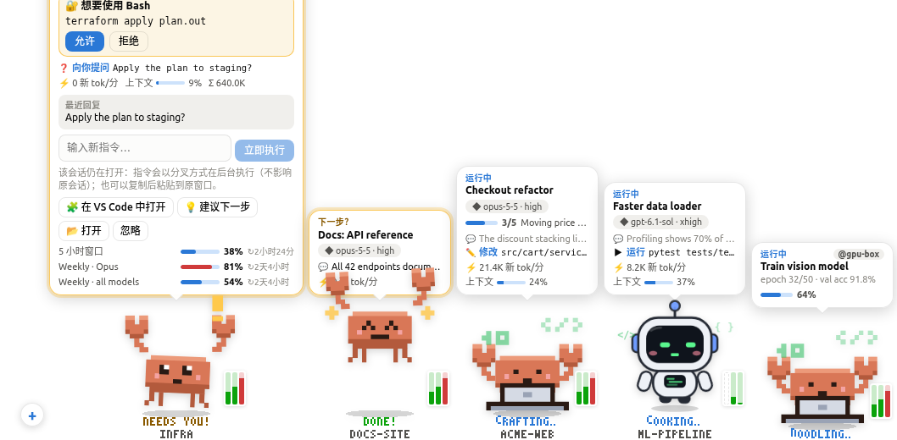</p>

<p align="center"><b>🌱 还有一块用 Token 浇灌的螃蟹农场</b>——智能体烧掉的 Token 拿来开箱抽种子，写代码的时候植物在长，农友之间还能互相串门浇水。<a href="#螃蟹农场">详情 ↓</a></p>
<p align="center">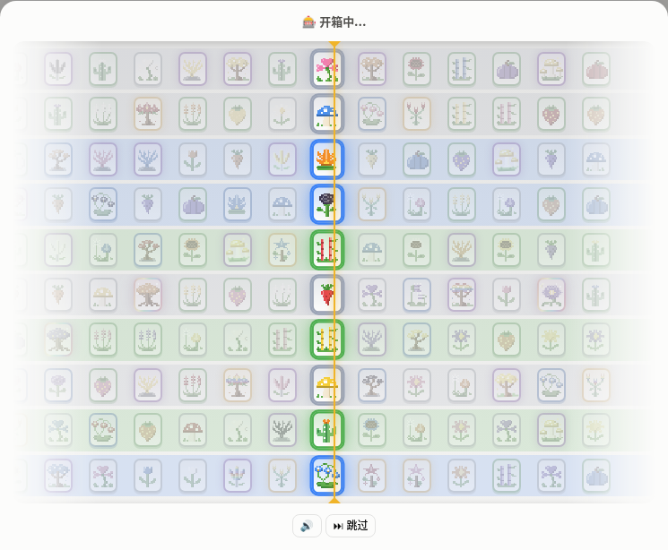 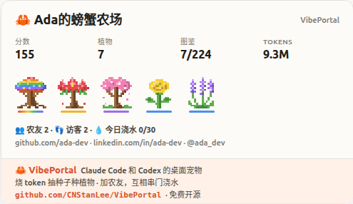</p>

## 为什么选 VibePortal

你同时开着好几个智能体：某个会话在等你授权，另一个刚做完，而每周额度比你以为的更接近上限。VibePortal 把这些都变成一眼就能看懂的东西。

| 工具 | 桌面宠物 | Claude Code | Codex | 实时进展（计划、工具调用） | 订阅限额 | 允许 / 拒绝授权 | 开新任务、追加指令 | 手机 / 网页 |
| --- | :-: | :-: | :-: | :-: | :-: | :-: | :-: | :-: |
| **VibePortal** | ✅ | ✅ | ✅ | ✅ | ✅ | ✅ | ✅ | ✅ |
| [Codex Pets][codexpets] <sub>官方</sub> | ✅ | ❌ | ✅ | ✅ | ❌ | ◐ | ◐ | ❌ |
| [Claude Code `/buddy`][buddy] <sub>官方</sub> | ✅ | ✅ | ❌ | ❌ | ❌ | ❌ | ❌ | ❌ |
| [clawd-on-desk][clawd] | ✅ | ✅ | ✅ | ◐ | ✅ | ✅ | ❌ | ❌ |
| [Claude Status Pet][csp] | ✅ | ✅ | ❌ | ◐ | ❌ | ❌ | ❌ | ❌ |
| [Desktop Goose][goose] · [Shimeji-ee][shimeji] · [BongoCat][bongo] | ✅ | ❌ | ❌ | ❌ | ❌ | ❌ | ❌ | ❌ |
| [ccusage][ccusage] | ❌ | ✅ | ✅ | ❌ | ◐ | ❌ | ❌ | ❌ |
| [Claude Code Usage Monitor][ccmonitor] | ❌ | ✅ | ❌ | ❌ | ✅ | ❌ | ❌ | ❌ |
| [CodexBar][codexbar] | ❌ | ✅ | ✅ | ❌ | ✅ | ❌ | ❌ | ❌ |
| [Claude Squad][squad] | ❌ | ✅ | ✅ | ◐ | ❌ | ◐ | ✅ | ❌ |
| [opcode][opcode] | ❌ | ✅ | ❌ | ◐ | ◐ | ❌ | ✅ | ❌ |
| [Vibe Kanban][kanban] | ❌ | ✅ | ✅ | ◐ | ❌ | ◐ | ✅ | ◐ |

<sub>✅ 支持 · ◐ 部分支持 · ❌ 不支持。依据各项目自己的页面或所引报道（2026 年 10 月）；“部分支持”例如只做状态反应而没有计划和工具调用、只有 Token 报告而没有实时限额、只能在该应用内授权、或网页界面只面向本机。</sub>

和宠物类工具的区别：

- **对比官方宠物**——Codex Pets 只在 Codex 桌面应用（Windows / macOS）里，只跟随 Codex；Claude Code 的 `/buddy` 是终端里的陪伴角色，不是状态显示。VibePortal 同时跟随 Claude Code **和** Codex 的会话（CLI 和 VS Code 都算），每个运行中的任务一只宠物，显示两家的订阅限额，支持 Ubuntu、Windows、网页和手机。
- **对比开源智能体宠物**——[clawd-on-desk][clawd] 和 [Claude Status Pet][csp] 根据 hooks 和日志对智能体状态做出反应。VibePortal 另外为每个任务显示实时计划和工具调用，提供面板来开新任务、按模型和强度追加指令、查看完整对话，还支持远程机器和智能体官方的 Remote Control。


[codexpets]: https://engadget.com/2162796/openai-introduces-ai-generated-pets-for-its-codex-app
[buddy]: https://www.mindstudio.ai/blog/what-is-claude-code-buddy-feature
[clawd]: https://github.com/rullerzhou-afk/clawd-on-desk
[csp]: https://github.com/moeyui1/claude-status-pet
[goose]: https://samperson.itch.io/desktop-goose
[shimeji]: https://kilkakon.com/shimeji/
[bongo]: https://github.com/ayangweb/BongoCat
[ccusage]: https://github.com/ryoppippi/ccusage
[ccmonitor]: https://github.com/Maciek-roboblog/Claude-Code-Usage-Monitor
[codexbar]: https://github.com/steipete/CodexBar
[squad]: https://github.com/smtg-ai/claude-squad
[opcode]: https://github.com/winfunc/opcode
[kanban]: https://github.com/BloopAI/vibe-kanban

- 🦀 **有正事干的宠物。** 改代码时敲电脑、跑命令时炒菜、读文件戴眼镜看书、等待时喝茶——脚下的像素字写着 *COOKING… / FORGING…* 和所在仓库；对话框同步智能体的计划、最近的工具调用和它说的话。
- ⚡ **靠得住的限额。** 与 `/usage`、`/status` 同源的数据，每个窗口有自己的重置时间，快用完**之前**就提醒你。
- 📱 **把工位装进口袋。** 带密码保护的链接（用 ngrok 或 Tailscale 获得永久地址）、带底部标签栏的手机界面、一键官方 Remote Control。
- 🌱 **给 Token 一块农场。** 智能体烧掉的 Token 换种子抽卡，在 3×3 田地里种出 27 种像素植物（最稀有的神话只有 0.1%），摆上展示柜，去好友农场串门浇水，还能分享卡片或实时更新的 GitHub README 徽章。
- 🔒 **本地优先。** 所有数据读自 `~/.claude` 和 `~/.codex`；令牌只发给各自的官方接口，不会离开你的电脑。

## 去中心化设计

**没有 VibePortal 服务器、没有 VibePortal 账号、没有遥测**——也就不存在一个可能泄漏你的数据、对话或令牌的中心。

- **一切留在你自己的机器上。** 每份 VibePortal 都运行在你的电脑上，只读取 Claude Code 和 Codex 本来就存在本机的数据（`~/.claude`、`~/.codex`）。机器之间直接通信——在局域网内，或经过你自己选择的隧道。
- **登录凭据从不移动。** Claude / ChatGPT 的令牌只在本机读取，只发往 Anthropic 和 OpenAI 自己的接口，和官方 CLI 完全一样；不会被复制、上传，也不会显示在界面上。
- **登录在本机校验。** 密码只以 scrypt 哈希的形式保存在那台机器上；Google 登录由每台机器用 Google 的公钥自行验证（任何地方都没有 client secret），设备列表存在**你自己** Google Drive 的隐藏应用文件夹里。
- **仍需你自己把关的：** 开启公网访问后，流量会经过你选择的中转（ngrok、Tailscale……），持有你的密码或 Google 账号的人可以操控你的智能体——请使用强密码，并保管好 Google 账号。

## 截图

<p align="center">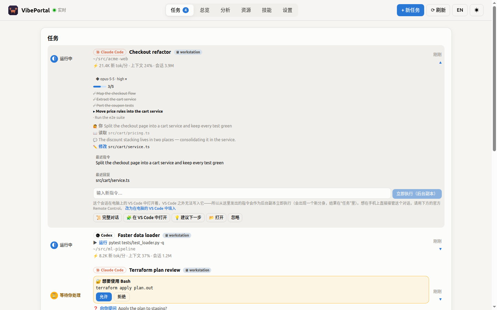</p>
<p align="center">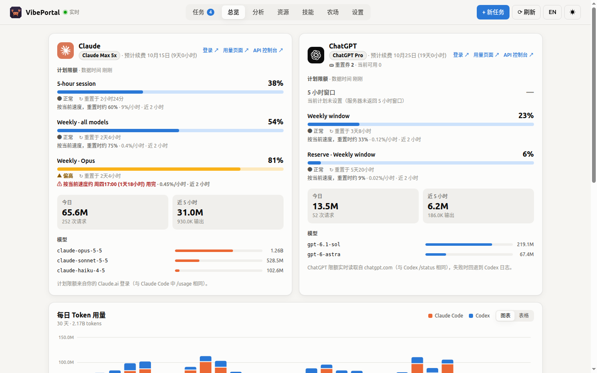</p>
<p align="center">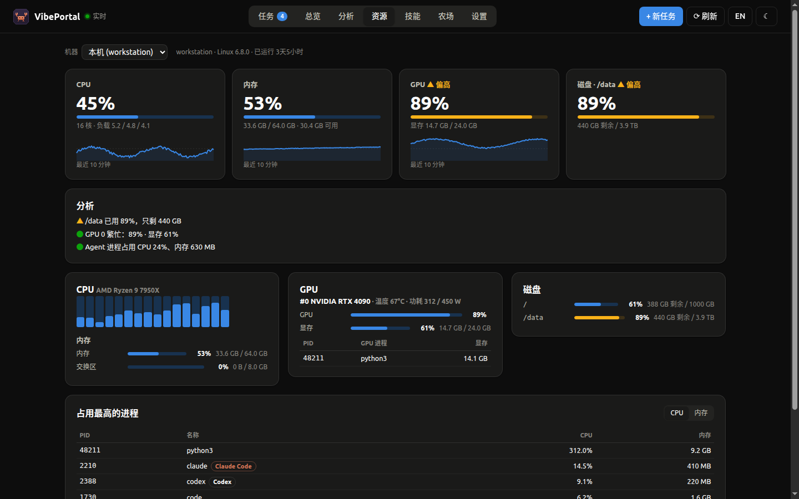</p>
<p align="center">
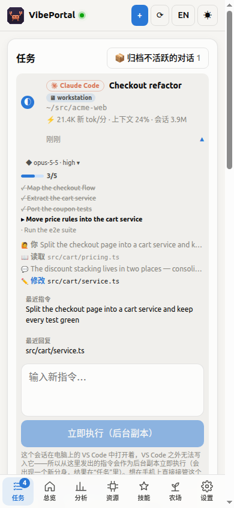
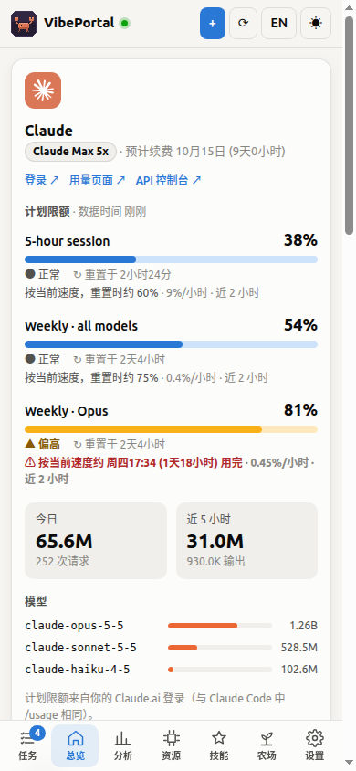
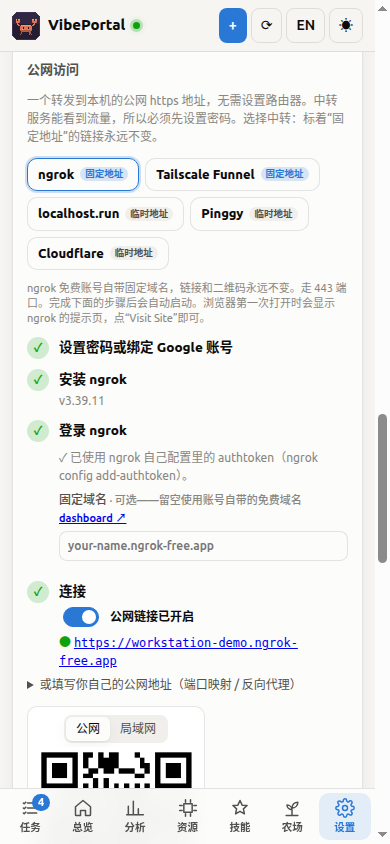
</p>
<p align="center">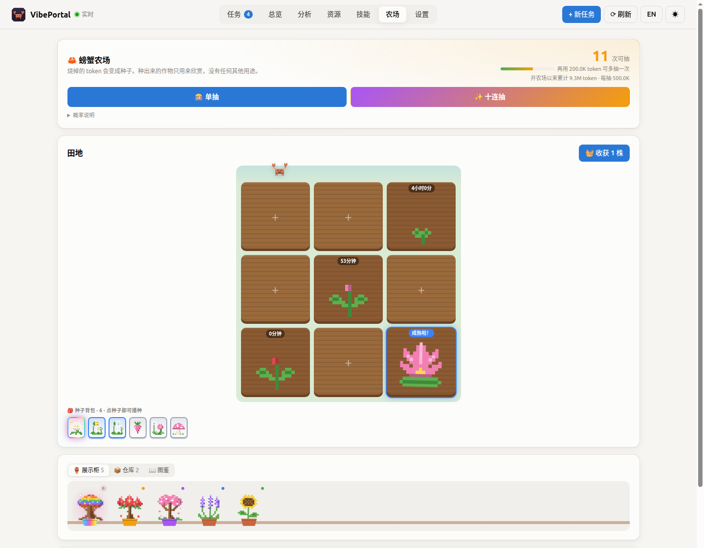</p>
<p align="center">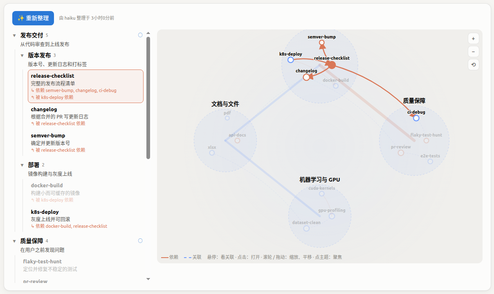</p>
<p align="center">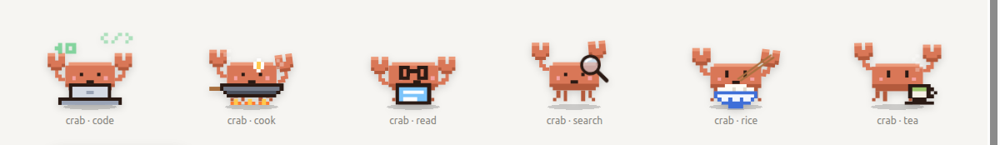</p>

<sub>截图使用内置的演示数据（`?demo`）；用 `npm run screenshots` 重新生成。</sub>

## 下载

每个 [Release](https://github.com/CNStanLee/VibePortal/releases/latest) 都附带安装包：

| 平台 | 文件 |
| --- | --- |
| Ubuntu / Debian | `vibeportal_x.y.z_amd64.deb`（`sudo apt install ./vibeportal_*.deb`），或便携的 `VibePortal-x.y.z.AppImage`（`chmod +x` 后运行） |
| Windows | `VibePortal Setup x.y.z.exe`（安装版）或 `VibePortal x.y.z.exe`（便携版） |

安装包未签名：Windows SmartScreen 可能需要确认（“更多信息 → 仍要运行”）。

## 功能

| 模块 | 内容 |
| --- | --- |
| **订阅计划** | Claude（Pro / Max 5x / Max 20x / Team…）与 ChatGPT（Plus / Pro / Pro Lite / Team…）当前计划、续费日期（服务商不返回时按订阅开始日逐月推算并标注“预计”）、ChatGPT **重置券** 数量；每张卡片带 **登录 / 用量页面 / API 控制台** 链接 |
| **限额监控** | Claude 5 小时会话、每周（全部模型 / 按模型）；ChatGPT 主/次窗口及额外额度池。**每个窗口单独显示自己的重置时间**（各窗口、两家之间互不共享）；5 小时窗口始终显示，计划没有该窗口时明确标注 |
| **用完预测** | 记录每个窗口的用量曲线，按“近 2 小时速度 / 本窗口平均速度”推算何时达到 100%，并判断是否会在重置前用完（会时发通知、宠物报警） |
| **重置日历** | 总览汇集各账户窗口的新鲜重置时间、观测到的额度回落和 Tibo（@thsottiaux）的消息。额外重置按近 120 天至少 4 次收录事件的间隔中间 50% 估计，标注低置信度及来源；条件承诺和重置券单列。每 30 分钟尝试读取 X 公开时间线，失败时保留缓存/收录资料并显示状态。 |
| **办公室工作目录** | 可选已知的本机仓库/编辑器目录，也可填写已有绝对路径。留空默认在首次开工时创建 `~/.vibeportal/workspaces/` 下的独立目录，团队后续运行沿用。手机访问时，目录仍属于运行 VibePortal 的主机。 |
| **分析** | 各仓库（按 git 根目录归并）的 Claude / Codex Token、占比、API 等价成本、14 天趋势、最近活跃；各模型的输入 / 输出 / 缓存明细；缓存命中率、消耗速度、日均；**订阅 vs 直接调用 API**：近 30 天的用量按 API 官方标价要花多少、对比方案月费，订阅省了多少钱、回本几倍 |
| **任务监控** | 自动发现 Claude Code 会话与 Codex 任务（运行中 / 等待你处理 / 空闲 / 完成），显示每个任务的工作负载（新 Token 速率、上下文占用、会话累计）；支持 Claude Code Hooks 即时推送；脚本可通过 HTTP 上报自定义任务；**一键归档不活跃的对话**：空闲 / 完成 / 失败的对话一次收进折叠的“已归档”列表（各设备共享），收起的对话一有新消息就自动回来 |
| **下一步动作** | 任务完成或需要你时，宠物会问“下一步？”：查看最近回复、让 Claude 给出建议、发送新指令（在 VS Code 中打开的会话会把指令交给那个会话本身，历史保持同一份）、打开仓库。**还在忙的后台运行也能追加指令**：指令排队，当前这轮一结束就在同一个会话里接着跑；卡片会停在执行你指令的那个运行上，后台运行和排队的指令**在 VibePortal 重启后继续** |
| **手机 / 网页继续** | 一键开启官方 Remote Control：Claude Code 为某个文件夹生成 claude.ai/code 链接和二维码；Codex 以远程控制模式启动守护进程并给出 ChatGPT App 配对码 |
| **桌面宠物** | Claude 像素小螃蟹 + Codex 圆头终端小机器人（屏幕就是它的脸）；两边都可以换成奶蛙，Codex 还可以换成鲸鱼娘。脚下用像素字显示正在忙什么（COOKING… / FORGING… / CRAFTING…）和所在仓库；状态框显示当前模型与强度，可为下一条指令切换。多任务时 **分身**：每个任务一只（Claude Code → 螃蟹，Codex → 小机器人），各自显示状态、负载并可单独下指令；无任务时显示两家的限额。头顶对话框 **同步进展**：计划进度（TodoWrite / Codex update_plan）、最近的工具调用和 Agent 的话，中英双语标签，直接解析本地日志与 Hooks，不额外调用模型。小螃蟹会按正在做的事 **演小剧场**：改代码时敲电脑、跑命令时炒菜、读文件戴眼镜看书、搜索拿放大镜、等待时喝茶、闲着吃白米饭。宠物右下角三根 **彩色小条**（5 小时 / 每周 / 最紧张的其它窗口）不点开也能看个大概。拖动移动、单击展开、双击打开面板、右键菜单 |
| **新任务** | 顶栏“＋ 新任务”或宠物旁的 ＋：选择仓库 / 本地 VS Code 项目（读取 VS Code 的最近文件夹与当前打开的窗口）、Claude Code 或 Codex、模型和强度，后台开启新会话；新任务出现时宠物**分身**登场 |
| **技能** | 列出 VibePortal 技能库、Claude Code / Codex 的用户技能和各仓库的技能文件夹（名称和描述直接读 SKILL.md，不调用模型）；任务中写出的 SKILL.md 自动归档到 `~/.vibeportal/skills`；可手动新建 / 编辑，一键安装到 Claude Code 或 Codex，开新任务时勾选技能（指令里附上 SKILL.md 路径，由 Agent 自己读取）。以可交互的**知识图谱**展示：主题知识树 + 可缩放的聚类图；点“整理知识树”让小模型（即“建议下一步”用的模型）把技能归入主题、各写一句话描述（随界面语言中 / 英），并找出技能之间的依赖与关联；悬停高亮关联，点击打开技能 |
| **资源** | 本机（或远程机器）的 CPU（每核）、内存 / 交换区、NVIDIA GPU（利用率、显存、温度、功耗、GPU 进程）、各磁盘、占用最高的进程（标出 Claude / Codex 进程），近 10 分钟趋势和自动分析；只在页面打开时采样 |
| **远程** | 一键允许局域网 / 手机访问（显示地址和二维码）；**访问密码**（设置后链接和二维码不再含令牌，扫码后密码登录）；**公网访问**：隧道——**固定地址**用 ngrok（免费账号自带固定域名）或 Tailscale Funnel；临时地址用 localhost.run / Pinggy（走系统自带的 ssh，无需安装和账号）或 Cloudflare 快速隧道——或填写自己的公网地址，必须先设置密码；可添加其它机器上的 VibePortal（如 GPU 服务器），其任务和限额合并显示，动作也会转发过去；局域网内自动发现 |
| **螃蟹农场** | 烧掉的 Token 换种子抽卡（40 万一抽，十连保底稀有）。**6 种品质、27 种像素植物**，从 15 分钟的雏菊到要长三天的世界树，10 种颜色，还有 0.1% 的**神话**品质和专属极光特效。种子在 3×3 田地里长成植物，进展示柜、仓库和图鉴。纯观赏——见[螃蟹农场](#螃蟹农场) |
| **农友** | 农场主页可关联 **GitHub、LinkedIn、X** 和个人网站；可选的**公开农场**链接，任何人都能来参观、帮你浇水（让植物长得更快）；**好友农场**和排行榜；**分享卡片**一键发到 LinkedIn / X / 手机分享面板，还有实时更新的 **GitHub 主页 README 徽章** |
| **Google 登录** | 每台设备都可“使用 Google 登录”，在本机校验；“我的设备”列出绑定到该账号的所有 VibePortal，列表存在你自己的 Google Drive |
| **其它** | 中英双语、浅色 / 深色主题、移动端适配、托盘菜单、开机自启 |

## 数据从哪里来

VibePortal 只读取本机已有的数据，不需要额外登录：

| 指标 | 来源 | 说明 |
| --- | --- | --- |
| Claude 计划与限额 | `~/.claude/.credentials.json` 中 Claude Code 的 OAuth token → `api.anthropic.com/api/oauth/usage` 与 `/profile` | 与 Claude Code 里 `/usage` 显示的是同一份数据，默认 5 分钟刷新一次。**不会刷新 token**（避免与 Claude Code 冲突）；token 过期时打开一次 Claude Code 即可 |
| ChatGPT 计划与限额 | `~/.codex/auth.json` 的登录 token → `chatgpt.com/backend-api/wham/usage`（Codex `/status` 用的同一接口） | 含重置券（`rate_limit_reset_credits`）。失败或 token 过期时回退到 Codex 日志中的 `rate_limits`，界面会标注数据时间 |
| Token 用量 / 仓库 / 负载 | `~/.claude/projects/**/*.jsonl` 与 `~/.codex/sessions/**/rollout-*.jsonl` | 增量读取；Claude 按 message id + request id 去重；仓库按会话工作目录所在的 git 根目录归并 |
| API 等价成本 | 内置 Claude 官方 API 价格表（含 5 分钟 / 1 小时缓存写入、缓存读取倍率） | 仅为估算，订阅并不按此计费；OpenAI 模型可在 `config.json` 的 `prices` 中自行添加 |
| Claude Code 会话状态 | `~/.claude/sessions/*.json`，以及可选的 Hooks | 进程退出的会话会自动移除 |
| API 花费 | Anthropic `cost_report` / OpenAI `organization/costs`（需要 Admin Key） | 可选 |

> Claude 的 `/api/oauth/*` 和 ChatGPT 的 `wham/usage` 都不是公开 API，字段可能变化；解析做了兼容处理，失败时会在卡片底部显示原因。

## 下一步动作是怎么执行的

- **建议下一步**：用 `claude -p --model haiku --no-session-persistence` 在一个空目录里运行（不碰你的仓库、不留会话），把任务最近的指令和回复交给它，返回 1–3 条建议。模型可在设置中修改。
- **发送指令**——目标是对话历史始终只有一份：
  - 在 **VS Code 中打开的 Claude 会话** → 通过系统 URL 处理程序（`xdg-open` / `open` / `rundll32 url.dll`）打开 `vscode://anthropic.claude-code/open?session=<id>&prompt=<指令>`，在 VS Code 里打开这个会话本身并填好指令，在那里按回车发送。也可以选择“作为独立副本在后台运行”（`--fork-session`）；
  - **终端里仍在运行的 Claude 会话** → 无法从外部写入，分叉执行或“复制并打开”；
  - **已结束的 Claude 会话** → `claude -p --resume <session>` 在后台续跑**同一个会话**，在 VS Code 里重新打开即可看到新的一轮；
  - **VS Code 中的 Codex 会话** → 打开 `vscode://openai.chatgpt/local/<id>`，指令已复制到剪贴板（Codex 扩展不支持预填）；也可以 `codex exec resume` 在后台续跑同一个会话；
  - 其它 Codex 会话 → `codex exec resume <session> -`。
  - 指令通过 stdin 传入，不经过 shell。后台运行会作为“Run”任务出现，完成后可查看输出。headless 模式下需要权限确认的工具会被拒绝（取决于你的 Claude Code / Codex 权限设置）。
- **权限**——新任务和指令默认使用 Claude Code 的 **auto 模式**（由它的安全分类器放行常规操作）。仍需授权的操作会以**允许 / 拒绝**的形式出现在面板、宠物对话框和手机上，可选“本次运行一直允许该工具”；15 分钟无人回答则自动拒绝。选择“每次问我”则全部询问。这是通过 Claude Code 的 permission-prompt 工具实现的：一个小型 MCP 服务器（`dist/mcp/permission.cjs`）经本机回环地址询问 VibePortal。Codex 在后台运行时没有询问机制：选“自动”或“改文件”会给它这个文件夹的写权限（`--sandbox workspace-write`）。
- **后台运行**会保留 7 天，可以查看完整对话（📜 完整对话）并继续。VS Code 有意不在历史列表里显示 headless 会话，所以每个后台运行都有**在 VS Code 中打开**，按 id 打开这个会话本身。
- **追加指令**——发给还在工作的后台运行的指令会排队（显示在运行下面，可以撤回），当前这轮一结束就在同一个会话里继续；多条排队指令合成一条发送。发给已结束运行的指令会作为同一个任务继续，宠物卡片 / 任务行会停在执行这条指令的运行上。
- **重启**——后台运行在自己的进程组里，输出写到 `~/.vibeportal/runs/<id>.out`，所以 VibePortal 重启（更新、崩溃）时它们照常跑；启动时会把仍在运行的接回来（`runs/running.json`），排队的指令也一样（`runs/queued.json`）。重启期间弹出的权限请求，会在 VibePortal 回来后重新询问。
- **为什么不直接写入 VS Code 里的会话**：两个扩展都独占自己的会话（Claude 扩展为每个会话启动一个由它的 stdin 驱动的 `claude` 进程，Codex 扩展在每个窗口内运行私有的 `codex app-server`），外部进程无法安全写入。上面的深链接是扩展官方提供的入口。
- 远程机器上的任务，动作会转发给那台机器的 VibePortal 执行。

## 螃蟹农场

附带的小游戏：智能体烧掉的 Token（输入 + 输出 + 缓存写入，所有服务商合计）换种子抽卡，种子长成像素植物。种出来的东西不影响其他任何功能。

<p align="center"></p>
<p align="center"> </p>

| 品质 | 概率 | 生长时间 | 品种 |
| --- | --- | --- | --- |
| 普通 | 55% | 15–40 分钟 | 雏菊、三叶草、郁金香、蒲公英、蘑菇、胡萝卜 |
| 优良 | 28% | 1–2 小时 | 薰衣草、大草莓、翠竹、向日葵、南瓜、仙人掌 |
| 稀有 | 11% | 3–5 小时 | 玫瑰、睡莲、蝴蝶兰、捕蝇草、盆景松 |
| 史诗 | 4.5% | 8–12 小时 | 水晶花、荧光菇、珊瑚树、樱花树 |
| 传说 | 1.4% | 18–24 小时 | 蟹爪兰、凤凰木、星辰树 |
| **神话** | **0.1%** | **2–3 天** | 月下美人、龙血树、世界树 |

- 抽卡像 CS:GO 开箱：一排种子包从指针下飞速划过，慢慢减速，停在你抽到的那颗上，每划过一颗“嗒”一声（可静音、可跳过）。十连是十条滚轴依次停下。
- 每抽 40 万 Token（开农场送三抽）；十连至少一个稀有或更好；80 抽内必出传说（神话不保底）。
- 品质越高，越可能出稀有颜色（墨色、鎏金、虹彩）。收获时有机会升一档品质（8%；传说 → 神话只有 1%）。
- 收获的植物摆上**展示柜**。从展示柜撤下的植物会收进**仓库**，不会丢：随时可以摆回去，也可以在仓库里把它永久送走。分数和图鉴两边都算。
- 农场存在 `~/.vibeportal/farm.json`，手机和电脑共用一块田。

### 农友：主页、好友和分享

- **主页**——名字、一句话介绍，以及 GitHub（用它的头像）、LinkedIn、X 和个人网站，农场出现的地方都会显示。**从 GitHub 一键导入**：读取你的 GitHub 公开主页（填写的用户名，或本机 `gh` 命令行登录的账号），自动填好名字、简介、网站，以及你在 GitHub 上关联的 X / LinkedIn，不需要任何授权。
- **公开农场**（默认关闭）——给农场一个猜不到的链接 `https://<你的公网地址>/#/visit/<id>`。拿到链接的人不用登录就能看到你的主页、最好的植物和田地（本机其他信息一概不公开），以及 VibePortal 是什么、怎么加你为农友，还能**浇水**：每株在长的植物提前 20 分钟成熟，每位访客每天一次，每天最多 30 次。“换新链接”会让旧链接失效。需要一个别人能访问的地址（设置 → 远程 → 从互联网访问），否则链接只在你的网络里能打开。
- **好友**——粘贴好友的农场链接，你的 VibePortal 会从他们的机器读取公开卡片，并和你一起排进排行榜（普通 1、优良 2、稀有 5、史诗 12、传说 30、神话 100 分）。可以直接帮他们浇水，你的到访会出现在他们那里，并附上回访你农场的链接。
- **分享**——分享卡片（你的植物、分数、图鉴、Token、农友和访客数、账号，以及一条 VibePortal 介绍、下载地址和仓库二维码的横幅）生成 PNG：手机分享面板（LinkedIn、微信……）、下载，或**发到 LinkedIn / X**：手机上通过分享面板把卡片和配文一起带进 App 的发帖界面；电脑上打开发帖页、配文已填好，卡片图片已复制，粘贴即可（网页链接本身没法附带图片）。公开农场后还可以复制 **GitHub 主页 README 徽章**——实时更新的农场 SVG：

  ```markdown
  [](https://<你的公网地址>/#/visit/<id>)
  ```

## 在手机 / 网页上继续（官方 Remote Control）

任务页底部的“在手机 / 网页上继续”卡片：

- **Claude Code**：选一个文件夹点“开启”，VibePortal 在该文件夹运行 `claude remote-control --name <机器 · 文件夹> --no-create-session-in-dir`，显示 claude.ai/code 链接和二维码。用 Claude App 或浏览器打开后开启的会话在本机这个文件夹中运行。Claude Code 只允许在已信任的文件夹中这样做。对还没信任的文件夹，VibePortal 会提供“信任此文件夹并开启”——与 Claude Code 自己的“是否信任此文件夹中的文件？”提示写入 `~/.claude.json` 的内容相同（信任后 Claude Code 会加载该文件夹的项目设置、hooks 和 MCP 服务器，只信任你了解的代码）。
- **Codex**：点“开启”运行 `codex remote-control start`（官方 app-server 守护进程，首次会安装到 `~/.codex/packages/`），再点“获取配对码”，在 ChatGPT App（Codex → 连接电脑）中输入。“停止”运行 `codex remote-control stop`。

VibePortal 只负责启动 / 停止官方 CLI 并显示它们的输出，不经手你的账号凭据。

## 快速开始

需要 Node.js ≥ 20。

```bash
npm install

# 桌面版（Ubuntu / Windows）：主面板 + 托盘 + 桌面宠物
npm run app

# Web 版：仅启动服务器，终端会打印带访问令牌的链接
npm run serve                       # 仅本机访问 http://127.0.0.1:8787
node dist/server/cli.cjs --host 0.0.0.0 --port 8787   # 局域网 / 手机访问

# 开发模式（服务器热重启 + Vite 热更新，打开 http://localhost:5173/?token=<令牌>）
npm run dev
```

> 在 VS Code 的终端里运行时，环境变量 `ELECTRON_RUN_AS_NODE=1` 会让 Electron 以纯 Node 方式启动。`npm run app` / `npm start` 已通过 `scripts/launch.mjs` 处理了这个问题。

### 打包

```bash
npm run dist:linux   # release/VibePortal-x.y.z.AppImage 与 vibeportal_x.y.z_amd64.deb
npm run dist:win     # release/VibePortal Setup x.y.z.exe（安装版）与便携版 .exe（建议在 Windows 上执行）
```

应用图标是像素小螃蟹，由 `npm run icons`（`scripts/make-icons.mjs`，无依赖）逐像素生成全部尺寸、Windows `.ico` 和托盘图标。

`.github/workflows/build.yml` 会在 GitHub Actions 上分别用 Ubuntu 和 Windows 跑类型检查、测试并打包，产物作为 artifact 上传。

## 任务状态：Claude Code Hooks（推荐）

不配置 Hooks 也能看到会话列表和忙 / 闲状态。配置后，**提问、工具调用、权限请求、结束** 等事件会即时推送，宠物也能在 Claude 等你授权时立刻提醒。

打开 **设置 → Claude Code Hooks**，复制生成的 JSON（已填好本机地址和令牌），合并进 `~/.claude/settings.json` 的 `hooks` 字段即可。每个事件执行的命令类似：

```bash
curl -s -m 2 -X POST -H 'Content-Type: application/json' -H 'Authorization: Bearer <token>' \
  --data-binary @- http://127.0.0.1:8787/api/hooks/claude >/dev/null 2>&1 || true
```

VibePortal 未运行时命令会在 2 秒内静默失败，不会影响 Claude Code。

## 自定义任务

训练脚本、CI、批处理……任何程序都可以上报状态：

```bash
TOKEN=$(python3 -c "import json,os;print(json.load(open(os.path.expanduser('~/.vibeportal/config.json')))['apiToken'])")

# 创建 / 更新（按 id 合并）。state: running | waiting | idle | done | failed，progress: 0–100
curl -X POST http://127.0.0.1:8787/api/tasks -H "Authorization: Bearer $TOKEN" \
  -H 'Content-Type: application/json' \
  -d '{"id":"train-42","title":"Train model","state":"running","progress":35,"detail":"epoch 7/20"}'

curl -X POST http://127.0.0.1:8787/api/tasks -H "Authorization: Bearer $TOKEN" \
  -H 'Content-Type: application/json' -d '{"id":"train-42","state":"done"}'
```

完成 / 失败的任务 1 小时后自动清除，长时间无更新的任务 24 小时后清除。

## HTTP API

除 `/api/health`、登录接口和公开农场的 `/api/public/farm/…` 外，所有接口都需要 `Authorization: Bearer <token>`（或 `?token=`，仅用于 EventSource）。

| 方法 | 路径 | 说明 |
| --- | --- | --- |
| GET | `/api/snapshot` | 当前完整快照（计划、限额、每日用量、任务、宠物状态） |
| GET | `/api/events` | Server-Sent Events：`snapshot`、`notice` |
| POST | `/api/refresh` | 立即刷新（远程数据源 30 秒内最多一次） |
| GET / PUT | `/api/settings` | 读取 / 修改设置（Admin Key 只写不读） |
| POST | `/api/hooks/claude` | Claude Code Hook 事件 |
| GET | `/api/hooks/snippet` | 生成 settings.json 的 Hooks 片段 |
| GET / POST | `/api/tasks` | 任务列表 / 上报自定义任务 |
| DELETE | `/api/tasks/:id` | 删除自定义任务 / 后台运行记录 |
| POST | `/api/tasks-archive` | 归档不活跃的对话 `{ids?}`（不带 ids 即全部），或恢复 `{restore: true, ids?}` |
| GET | `/api/tasks/:id/context` | 任务最近的指令与回复（后台运行则为输出） |
| POST | `/api/tasks/:id/suggest` | 让 Claude 给出下一步建议 `{lang}` |
| POST | `/api/tasks/:id/continue` | 发送新指令 `{prompt, model?, effort?}` |
| POST | `/api/tasks/:id/open` | 在 VS Code / 文件管理器中打开任务目录 |
| POST | `/api/tasks/:id/vscode` | 在 VS Code 中打开这个会话（Claude 可附带 `{prompt}` 预填） |
| GET | `/api/official` | 官方 Remote Control 状态 |
| POST / DELETE | `/api/official/claude` | 为文件夹开启 / 停止 Claude Remote Control `{cwd}` / `?cwd=` |
| POST | `/api/official/codex/start\|stop\|pair` | Codex 远程控制守护进程 / 配对码 |
| POST / DELETE | `/api/hosts`、`/api/hosts/:id` | 添加 / 移除远程机器 `{url, token}` |
| GET | `/api/launch/options` | 新任务可选的项目、智能体、模型和强度 |
| POST | `/api/launch` | 开启新任务 `{agent, cwd, prompt, model?, effort?, permission?}` |
| GET | `/api/resources[?host=<id>]` | 本机（或远程机器）的资源快照 |
| GET / POST | `/api/skills` | 技能列表 / 新建 `{name, description, body}` |
| GET / PUT / DELETE | `/api/skills/:id` | 查看 / 修改 SKILL.md `{content}` / 删除（仅技能库） |
| POST / DELETE | `/api/skills/:id/install?target=claude\|codex` | 安装 / 卸载到 Claude Code 或 Codex |
| GET / POST | `/api/skills/graph` | 知识图谱 / 用小模型重新整理（约一两分钟） |
| POST | `/api/login` | 密码登录 `{password}` → 会话令牌（无需令牌） |
| POST | `/api/login/google` | Google 登录 `{credential}`（ID token）→ 会话令牌 |
| POST | `/api/google/bind` | 把已登录的 Google 账号绑定到本机（仅本机） |
| GET | `/api/farm` | 农场（累计 Token、抽数、种子、田地、展示柜、仓库） |
| POST | `/api/farm/draw\|plant\|harvest\|uproot\|store\|display\|discard` | 农场操作 `{count}` / `{plot, seedId}` / `{plot}` / `{cropId}`（store：展示柜 → 仓库，display：摆回，discard：永久送走） |
| GET / POST | `/api/farm/social` | 主页资料和公开开关 `{profile?, public?}` |
| POST | `/api/farm/social/rotate` | 换新分享链接（旧链接失效） |
| POST | `/api/farm/social/github` | 从 GitHub 公开主页生成农场主页 `{github?}`（不填则用 gh 命令行登录的账号） |
| GET / POST / DELETE | `/api/farm/friends` | 好友农场（从他们的机器读取）/ 添加 `{link}` / 移除 `{url}` |
| POST | `/api/farm/friends/water` | 给好友浇水 `{url}` |
| GET | `/api/public/farm/:id` | 公开农场的卡片（无需令牌；未公开时 404） |
| POST | `/api/public/farm/:id/water` | 给公开农场浇水 `{name, github?, farm?}`（无需令牌；每位访客每天一次） |
| GET | `/api/public/farm/:id/card.svg[?lang=zh]` | 农场卡片 SVG，用于 GitHub README（无需令牌） |

## 配置

配置保存在 `~/.vibeportal/config.json`（权限 0600），大部分选项都可以在界面的“设置”页修改。

| 环境变量 | 作用 |
| --- | --- |
| `VIBEPORTAL_HOME` | 配置目录（默认 `~/.vibeportal`） |
| `VIBEPORTAL_HOST` / `VIBEPORTAL_PORT` | Web 模式监听地址 / 端口 |
| `CLAUDE_CONFIG_DIR` / `CODEX_HOME` | Claude Code / Codex 数据目录（首次运行时作为默认值） |
| `ANTHROPIC_ADMIN_KEY` / `OPENAI_ADMIN_KEY` | Admin Key 初始值 |

`config.json` 中还可以设置：`claudeBin` / `codexBin`（CLI 不在 PATH 中时）、`suggestModel`、`prices`（例如 `{"gpt-6-astra": {"input": 2, "output": 8, "cacheRead": 0.2}}`，单位：美元 / 百万 Token）。

## 远程访问

- **手机 / 其它电脑看本机**：设置 → 远程 → 勾选“允许远程访问”。服务器会改为监听所有网卡，并显示局域网地址和二维码（链接里带访问令牌）。Web 模式也可以用 `--host 0.0.0.0` 启动。
- **公网访问**：先设置密码，再开启隧道（或填写自己的公网地址），二维码可在公网 / 局域网之间切换。
  - **固定地址（推荐）**：*ngrok*——免费账号自带固定域名，安装 ngrok 并登录（`ngrok config add-authtoken …`，或在设置里粘贴 token），域名可留空使用账号自带的；选择中转后，清单里的步骤一完成就会自动启动，域名被别的 ngrok 会话占用时会自动重试直到空出；*Tailscale Funnel*——安装 Tailscale、`tailscale up`，按提示允许 Funnel，地址为 `https://<机器>.<tailnet>.ts.net`。两者都走 443 端口。
  - **临时地址、无需设置**：localhost.run（22 端口）/ Pinggy（443 端口）走 ssh，免费地址会不定期更换（二维码自动跟随）；Cloudflare 快速隧道（需要 cloudflared 和 7844 端口）。
- **Google 登录与我的设备**：设置 → Google 账号。在 Google Cloud 中免费创建一个 OAuth 客户端（Web 应用），加入页面列出的来源（`http://localhost:8787`、你的公网链接），同意屏幕保持“测试”并把你的 Gmail 加为测试用户，启用 Google Drive API，然后粘贴客户端 ID 并绑定账号。之后手机上会出现“使用 Google 登录”，“我的设备”列出绑定到该账号的所有 VibePortal（在线状态，一键打开——Google 会在那台设备上自动登录）。所有设备使用同一个客户端 ID。
- **汇总其它机器**：在那台机器上运行 VibePortal（桌面版或 `node dist/server/cli.cjs`），打开远程访问，复制它设置页里的“连接链接”，粘贴到本机“远程机器”中添加即可。同一局域网内开启了远程访问的实例会被自动发现。
- 远程任务带 `@机器名` 标记，宠物分身同样会显示它们；“下一步动作”会在任务所在的机器上执行。

## 安全

- 服务器默认只监听 `127.0.0.1`；开启远程访问后监听所有网卡，所有请求仍需访问令牌（首次运行随机生成）。**请只在可信网络中开启**。持有令牌或密码的人可以通过“下一步动作”和“新任务”在本机运行 Claude Code / Codex。
- 设置远程访问密码后（scrypt 哈希保存）：远程浏览器需用密码登录（会话 30 天，修改密码即全部失效；连续输错会被锁定）；局域网内只有另一台 VibePortal 可用请求头携带令牌；经隧道 / 反向代理来的公网请求**只接受密码会话**，从不接受令牌。密码、公网访问和远程开关只能在本机修改。
- 公网访问必须先设置密码。隧道连到一个专用的本地端口，经它进来的请求一律按公网处理（不依赖转发头）。隧道地址在重启后会变化；中转服务能看到流量。localhost.run 走 22 端口，Pinggy 走 443 端口（免费隧道 60 分钟后自动重连换地址），Cloudflare 需要出站 7844 端口（校园网 / 公司网常被屏蔽，界面会提示）。SSH 隧道不会发送你的 SSH 密钥，主机指纹记录在 `~/.vibeportal/known_hosts`。
- Claude / Codex 的 OAuth token 只在本机读取，只发送给各自的官方接口，不会写入日志或返回给前端。
- Admin Key 和远程机器的令牌只保存在本机配置文件（权限 0600）中，前端看不到。
- 局域网发现只广播机器名、端口和实例 ID，不广播令牌。
- **公开农场**只在开启时、只在它的随机 id 下开放三个免令牌接口：卡片（主页、植物、田地、累计 Token——没有任务、路径或用量明细）、浇水（按访客和地址限次）以及 SVG。好友的卡片来自别人的机器：由 VibePortal 自己去取（8 秒超时、限制大小、不跟随跳转），只保留格式正确的字段后才显示。

## 项目结构

```
src/
  shared/types.ts            前后端共用类型
  shared/farm.ts             螃蟹农场规则（抽卡、品种、生长、收获）
  shared/farmArt.ts          像素植物（16×16 点阵）
  shared/farmSocial.ts       农场主页、公开卡片、农场链接
  shared/farmCard.ts         分享卡片 / README 徽章（SVG，带仓库二维码）
  shared/plans.ts            订阅方案标价（订阅 vs API）
  core/                      数据采集（Node）
    collectors/claudeLocal.ts         Claude Code 会话记录 → Token 统计
    collectors/claudeSubscription.ts  Claude 计划与限额
    collectors/codexLocal.ts          Codex 日志 → Token / ChatGPT 限额 / 任务
    collectors/chatgptUsage.ts        ChatGPT 实时限额
    collectors/apiCosts.ts            Admin API 花费
    ledger.ts / prices.ts    按天 / 模型 / 仓库 / 会话汇总，API 价格表
    forecast.ts              限额曲线与用完预测
    tasks.ts                 Claude Code 会话 + Hooks + 自定义任务
    archive.ts               已归档的对话（~/.vibeportal/archived.json）
    activity.ts              任务进展（工具调用 / 回复 / 计划）→ 宠物对话框
    actions.ts               下一步动作（建议 / 续跑 / 打开）
    remote.ts                远程机器汇总、局域网发现
    projects.ts              新任务可选的项目（Agent 历史 + VS Code 最近文件夹）
    resources.ts             本机资源采样（CPU / 内存 / GPU / 磁盘 / 进程）
    tunnel.ts                公网隧道（localhost.run / Pinggy / Cloudflare）
    skills.ts                技能发现、自动归档、安装
    skillGraph.ts            技能知识图谱（由小模型整理）
    officialRemote.ts        官方 Remote Control（claude remote-control / codex remote-control）
    farm.ts / farmSocial.ts  农场及其社交功能（~/.vibeportal/farm*.json）、好友农场
    monitor.ts               轮询调度、快照、通知、宠物心情
  server/                    HTTP + SSE 服务器，Web 模式入口 cli.ts；auth.ts 令牌 / 密码会话
  electron/                  桌面外壳：主窗口、透明宠物窗口、托盘、通知、开机自启
  ui/                        React 前端（面板、分析、设置、宠物；#/gallery 可预览所有宠物表情）
test/                        单元测试（npm test）
```

## 致谢

Claude / OpenAI / Codex 标志的路径数据来自 [lobe-icons](https://github.com/lobehub/lobe-icons)（MIT），仅用于标识对应服务；这些标志是其各自所有者的商标。

## 已知限制

- macOS 上 Claude Code 把凭据存在钥匙串里，暂不支持读取 Claude 限额（Token 统计和任务监控不受影响）。
- ChatGPT 限额来自 Codex 使用的接口；网页版 / App 的对话不计入 Token 统计（没有本地数据）。
- 无法把指令直接注入一个仍在交互中的会话（Claude 的会话间消息通道带有身份校验和审批，VS Code 扩展独占自己的会话，VibePortal 不绕过）；VS Code 中的会话通过扩展的深链接打开并预填，终端会话则分叉执行或复制后粘贴。
- Linux 下宠物窗口的透明效果需要合成器（GNOME / KDE 默认开启）。

## 常见日志

- `MESA-LOADER: failed to open …`：Electron 沙盒化的 GPU 进程无法加载 Mesa 驱动。VibePortal 在 Linux 上已关闭硬件加速（纯 2D 界面不需要，透明窗口也更稳定），这些日志不会再出现。
- `Failed to load module …/snap/code/…/gio-modules/…`：从 **Snap 版 VS Code** 的终端启动时，VS Code 把自己的 GTK / GIO 路径传给了子进程。`npm run app` / `npm start` 会还原这些环境变量。
- `Fontconfig warning: … generated by a newer version`：系统字体缓存被 Snap 应用里较新的 Fontconfig 写过，与 VibePortal 无关。可以运行 `rm -rf ~/.cache/fontconfig && fc-cache -f` 重建（Snap 应用会自动重建它们自己的缓存）。
